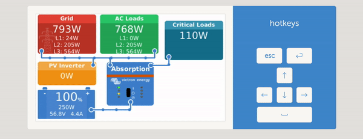
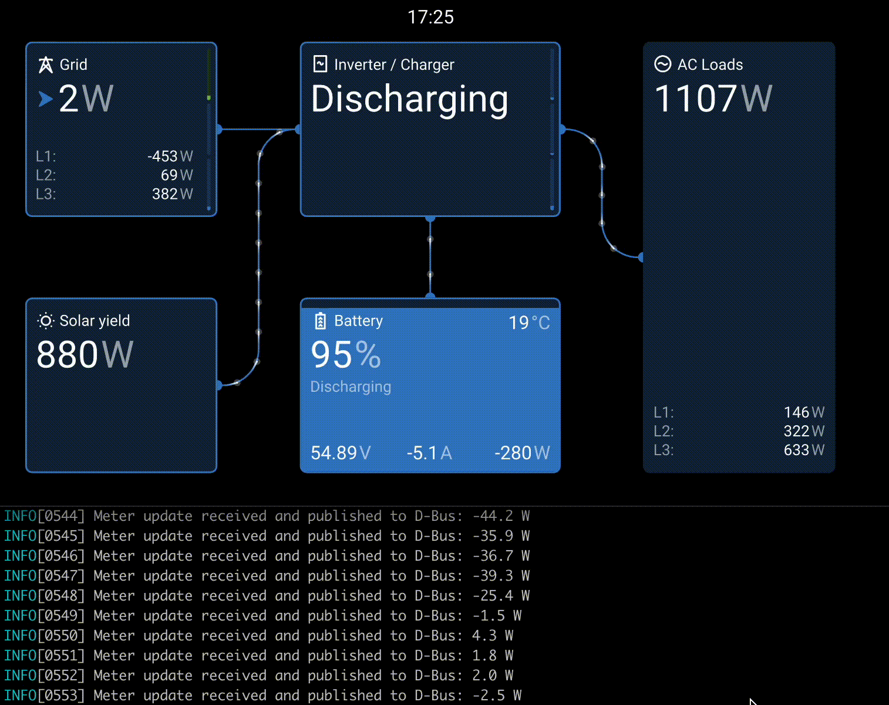

# SMA Home Manager to Victron ET340 Bridge

This program lets your Victron system read power and energy data from an SMA Home Manager, or SMA Energy Meter as if it were a Victron ET340 meter.  
**No extra meter hardware is needed!**





---

## How to use it

Use this at your own risk, I have no association with Victron or SMA and am providing
this for anyone who already has these components and wants to play around with this.

Note that the processor is quite slow in the Victron Venus GX; If the portal stops updating while this is running, this is because there aren't enough resources. I run mine on a raspberry pi 4.

### 1. Prepare your Victron device

- Enable "Superuser" mode:
  Go to **Settings → General** and activate Superuser (see [Victron docs](https://www.victronenergy.com/live/ccgx:root_access)).
- Set an SSH password and enable SSH on LAN (in the same menu).

### 2. Get the program

- Download the file named `shm-et340` from the latest [releases](https://github.com/mitchese/shm-et340/releases)

### 3. Copy the program to your Victron device

- Use a tool like **WinSCP** (Windows) or the `scp` command (Mac/Linux) to copy the file to your Victron device.

### 4. Run the program

- Use **Putty** (Windows) or a terminal (Mac/Linux) to SSH into your Victron device.
- In the terminal, type:
  ```
  ./shm-et340
  ```
- You should see output like this:
  ```
  Meter update received and published to D-Bus: 484.0 W
  ```
### 5. Permanent Installation

- [christian1980nrw](https://github.com/christian1980nrw) has created a nice and easy install script, just run the install.sh which should do everything below. This is not immutable, so only run it once, if it fails then follow each command in the script

---

## What should I see?

- Your Victron dashboard will show grid power, voltage, current, and energy values as if you had a real ET340 meter.
- The program will print updates every meter update, which is every second.

## Troubleshooting

- **No data or stops after a few minutes?**
  Make sure "IGMP Snooping" is enabled on your network switches/routers. This is needed for the data to reach your Victron device.
- **Multiple Meters**
  If you have multiple meters, you can specify which serial number this should use with the `SMASUSYID=1234567890` environment variable. The meter's serial number can be found in the web UI of your inverter under Device Configuration -> Meter on Speedwire -> Serial

---

## Advanced: Settings

You can change some settings by setting environment variables before running the program:

- `SMA_ENERGY_METER=true`
  Use this if you have the older SMA Energy Meter 1.0 (most people can ignore this).
- `LOG_LEVEL=debug`
  Shows more detailed information for troubleshooting.
- `SMASUSYID=1234567890`
  Ignores meter updates from all meters except ones with this serial


Example:
```
SMA_ENERGY_METER=true LOG_LEVEL=debug ./shm-et340
```

---

## For advanced users: Compiling from source

If you want to build the program yourself, you'll need Go installed.
Run:
```
go build -o shm-et340 main.go
```
Or cross-compile for your device. For the ARM processors on victron devices,
```
GOARCH="arm" GOOS="linux" go build -o shm-et340 main.go
```

---

## License

This program is free software: you can redistribute it and/or modify it under the terms of the GNU General Public License as published by the Free Software Foundation, either version 3 of the License, or (at your option) any later version.

This program is distributed in the hope that it will be useful, but WITHOUT ANY WARRANTY; without even the implied warranty of MERCHANTABILITY or FITNESS FOR A PARTICULAR PURPOSE. See the GNU General Public License for more details.

You should have received a copy of the GNU General Public License along with this program. If not, see https://www.gnu.org/licenses/.

