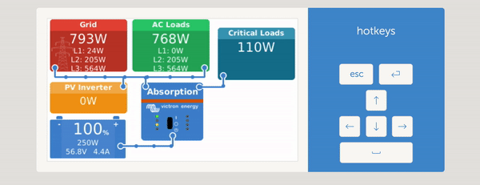
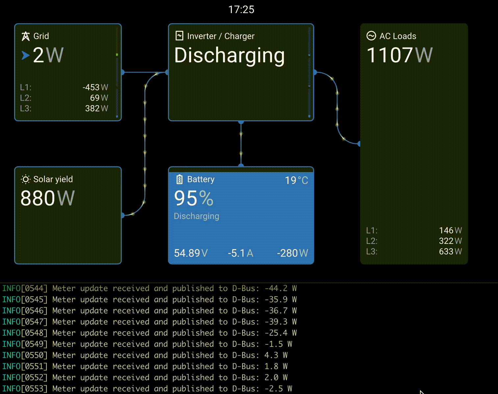

# SMA Home Manager to Victron ET340 Bridge

This program lets your Victron system read power and energy data from an SMA Home Manager, or SMA Energy Meter as if it were a Victron ET340 meter.
**No extra meter hardware is needed!**





---

## How to use it

Use this at your own risk, I have no association with Victron or SMA and am providing
this for anyone who already has these components and wants to play around with this.

Note that the processor is quite slow in the Victron Venus GX; If the portal stops updating while this is running, this is because there aren't enough resources. I run mine on a raspberry pi 4.

### 1. Prepare your Victron device

- Enable "Superuser" mode:
  Go to **Settings → General** and activate Superuser (see [Victron docs](https://www.victronenergy.com/live/ccgx:root_access)).
- Set an SSH password and enable SSH on LAN (in the same menu).

### 2. Get the program

- Download the file named `shm-et340` from the latest [releases](https://github.com/mitchese/shm-et340/releases)

### 3. Copy the program to your Victron device

- Use a tool like **WinSCP** (Windows) or the `scp` command (Mac/Linux) to copy the file to your Victron device.

### 4. Run the program

- Use **Putty** (Windows) or a terminal (Mac/Linux) to SSH into your Victron device.
- In the terminal, type:
  ```
  ./shm-et340
  ```
- You should see output like this:
  ```
  Meter update received and published to D-Bus: 484.0 W
  ```
### 5. Permanent Installation

For a one-command install that downloads the latest release, sets up the runit service, and survives firmware updates:
```
wget -qO- https://raw.githubusercontent.com/mitchese/shm-et340/master/install.sh | sh
```

The install script:
- Downloads the latest release binary
- Creates the runit service (auto-restart, log capture)
- Adds itself to `/data/rc.local` so it survives Venus OS firmware updates
- Preserves your existing service config on re-runs (safe to run again for upgrades)

After installation:
- Check status: `sv status shm-et340`
- View logs: `cat /var/log/shm-et340/current`
- Run diagnostics: `/data/drivers/shm-et340/shm-et340 --diagnose`

---

## What should I see?

- Your Victron dashboard will show grid power, voltage, current, and energy values as if you had a real ET340 meter.
- The program will print updates every meter update, which is every second.

## Troubleshooting

- **No data or stops after a few minutes?**
  Make sure "IGMP Snooping" is enabled on your network switches/routers. This is needed for the data to reach your Victron device.
- **Use the built-in diagnostics:**
  ```
  ./shm-et340 --diagnose
  ```
  This runs automated checks for network interfaces, multicast reception, and D-Bus connectivity, and prints actionable guidance for common issues like IGMP snooping.
- **Multiple Meters**
  If you have multiple meters, you can specify which serial number this should use with `--susy-id=1234567890` or the `SMASUSYID=1234567890` environment variable. The meter's serial number can be found in the web UI of your inverter under Device Configuration -> Meter on Speedwire -> Serial

---

## Advanced: Settings

Settings can be provided as CLI flags or environment variables. CLI flags take precedence.

| Flag | Env Var | Default | Description |
|------|---------|---------|-------------|
| `--energy-meter` | `SMA_ENERGY_METER=true` | `false` | SMA Energy Meter 1.0 mode (vs SHM 2.0) |
| `--log-level` | `LOG_LEVEL` | `info` | Log level: debug, info, warn, error |
| `--susy-id` | `SMASUSYID` | `0` (all) | Only accept packets from this SMA serial |
| `--interface` | `INTERFACE` | (all) | Bind to a specific network interface (e.g. eth0) |
| `--multicast-address` | `MULTICAST_ADDRESS` | `239.12.255.254:9522` | SMA multicast address:port |
| `--dbus-name` | `DBUS_NAME` | `com.victronenergy.grid.cgwacs_ttyUSB0_di30_mb1` | D-Bus service name |
| `--stale-timeout` | `STALE_TIMEOUT` | `30` | Seconds without data before marking meter stale |
| `--diagnose` | — | — | Run diagnostic checks and exit |
| `--version` | — | — | Print version and exit |

Example:
```
./shm-et340 --energy-meter --log-level=debug
```
Or with environment variables (backward compatible):
```
SMA_ENERGY_METER=true LOG_LEVEL=debug ./shm-et340
```

### Stale Data Protection

If no meter data is received for 30 seconds (configurable with `--stale-timeout`), the program automatically:
- Sets `/Connected` to 0 on D-Bus
- Zeros out all power and current values
- Logs a warning

When data resumes, it automatically recovers and sets `/Connected` back to 1.

---

## For advanced users: Compiling from source

If you want to build the program yourself, you'll need Go installed.
Run:
```
go build -o shm-et340 .
```
Or cross-compile for your device. For the ARM processors on victron devices,
```
GOARCH=arm GOOS=linux go build -o shm-et340 .
```

To set the version at build time:
```
go build -ldflags "-X main.Version=v1.0.0" -o shm-et340 .
```

---

## License

This program is free software: you can redistribute it and/or modify it under the terms of the GNU General Public License as published by the Free Software Foundation, either version 3 of the License, or (at your option) any later version.

This program is distributed in the hope that it will be useful, but WITHOUT ANY WARRANTY; without even the implied warranty of MERCHANTABILITY or FITNESS FOR A PARTICULAR PURPOSE. See the GNU General Public License for more details.

You should have received a copy of the GNU General Public License along with this program. If not, see https://www.gnu.org/licenses/.
